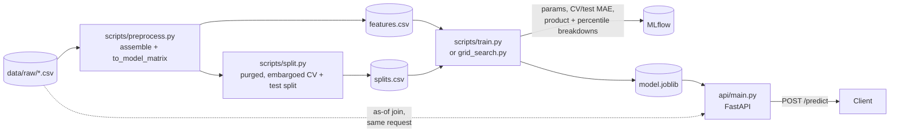

# starwars_autocall

ML pipeline to predict the average duration of autocallable structured products from RFQ terms,
market volatility and underlying reference data. Covers exploratory analysis, feature engineering,
a purged/embargoed time-based validation split, LightGBM training with full MLflow tracking, and a
FastAPI inference service that runs a live request through the same feature pipeline used for
training.

Everything runs in Docker; the Python code itself targets 3.10+ (it uses `X | None` type hints
throughout) and is pinned against 3.12, which is what the image builds.

## Quick start

```bash
docker compose build dev
```

The repo ships `data/raw/*.csv` and a trained `data/processed/v1/model.joblib`, so the API can be
exercised immediately without training anything:

```bash
docker compose run --rm --service-ports dev \
    uvicorn api.main:app --host 0.0.0.0 --port 8000
```

```bash
curl http://localhost:8000/health
```

To reproduce that model from the source CSVs instead:

```bash
docker compose run --rm dev python scripts/preprocess.py   # data/raw -> data/processed/vN/features.csv
docker compose run --rm dev python scripts/split.py        # -> data/processed/vN/splits.csv
docker compose up -d mlflow                                 # tracking UI at http://localhost:5000
docker compose run --rm dev python scripts/train.py         # -> data/processed/vN/model.joblib
```

Each script is safe to re-run: `preprocess.py` only reads `data/raw` and writes a new `vN/` (or
overwrites `--version N` if given explicitly); `split.py` and `train.py` default to the latest
existing version.

## Pipeline



### 1. Exploratory data analysis (`scripts/run_eda.py`)

Profiles the three raw tables before any cleaning or integration.

```bash
docker compose run --rm dev python scripts/run_eda.py
```

Writes `reports/eda/EDA.md` (the profile), `eda_report.json` (the same numbers, machine readable)
and `figures/`. `--raw-dir` and `--out-dir` override the defaults; the script only reads `data/raw`
and overwrites its own outputs. The EDA report stays descriptive; the feature-engineering and
validation decisions that follow from it are laid out below.

### 2. Feature engineering (`scripts/preprocess.py`)

Turns `rfqs.csv`, `daily_volatility.csv` and `underlyings_reference.csv` into one model matrix:

- Derives `tenor_months` from `end_date - start_date`, and `basket_size` from the pipe-separated
  `underlyings` column.
- Normalises `observation_frequency`'s 18 raw labels (English, Spanish, code-style) to a plain
  months-between-observations integer via `FREQ_MONTHS`.
- As-of joins `realized_vol_63d` per leg and the cross-sectional daily mean (`mkt_vol`) onto each
  RFQ's `requested_date`, plus the static `structural_base_vol` reference level.
- Filters to the modelling universe: executed RFQs with a labelled target, minus 303 rows where
  `avg_duration_months` exceeds the tenor implied by `end_date - start_date`. These can't be an
  averaging artifact, since every simulated path is tenor-capped, so an average of capped values
  must be too; 213 of the 303 concentrate in one product (`Wretched Hive Digital`), which reads as
  a data issue on that product rather than noise.
- One-hot encodes `product_type`, the strongest categorical driver (eta² 0.25). `basket_type` and
  `basket_size` are dropped as trained features, since both are fully determined by `product_type`;
  `basket_size` is still checked at runtime as an assertion against `underlyings`, since it's free
  to compute and catches a malformed request before it silently mispredicts.

Output is versioned: `data/processed/v1/features.csv`, `v2/`, etc.

### 3. Validation split (`scripts/split.py`)

A date-based test split (most recent 20%) plus a blocked, purged/embargoed 5-fold CV over the
remaining train_val pool. Two reasons this isn't a random split:

- `rv_mean`/`rv_max`/`rv_min`/`rv_spread`/`vol_regime_ratio` are all built from a 63-trading-day
  rolling statistic, so a row just across a fold boundary shares up to 63 days of history with a row
  on the other side. Each fold purges a 90-calendar-day gap on both sides of its validation block
  before assigning the remainder to training.
- Realised vol also has a genuine ~1.8-year mean-reverting cycle (confirmed by FFT + ADF in the
  EDA) that a random split would let leak between train and test.

Writes `data/processed/vN/splits.csv`, row-aligned with `features.csv`: a `split` column
(`train_val`/`test`) plus one `fold_0`..`fold_4` column valued `train`/`val`/`purged`.

### 4. Training (`scripts/train.py`)

Fits a LightGBM regressor on the purged folds, reports honest out-of-time MAE, then fits once more
on train_val, early-stopping against `fold_4`'s val block (its most recent, already-purged block),
and scores it on the held-out test split - test is never passed to `.fit()`, only `.predict()`-ed
on, so it can't influence how many boosting rounds get fit. Every run is logged to MLflow
(experiment `autocall-duration`): params, per-fold and summary metrics, a full per-boosting-round
train/val loss curve, and the model itself.

Two breakdowns beyond the pooled MAE, since that number can hide a model that's fine everywhere
except one product or one part of the target's range:

- **By `product_type`**: `test_mae_product_{name}`.
- **By target quartile**: `test_mae_by_target_pctile`, since the target is right-skewed.

```bash
docker compose up -d mlflow
docker compose run --rm dev python scripts/train.py
```

Then compare runs at <http://localhost:5000>. `--fold-curves` also logs the full loss curve for
every CV fold, not just the final model (off by default, since it's 5x the step-metric calls for a
diagnostic mostly useful when chasing a specific overfitting fold).

### 5. Hyperparameter search (`scripts/grid_search.py`)

Grid over `num_leaves`, `learning_rate`, `min_child_samples`, `n_estimators` and `random_state` (the
last one to see how much the ranking moves from re-seeding alone), 3×4×3×3×3 = 324 combinations,
reusing `train.py`'s `run_training()` so every combination lands in the same MLflow experiment and
can be sorted or compared there. Grid runs skip the loss curve and model artifact
(`tags.grid_search = "true"`) to keep wall time down (~5-6s/combo); the winning combination
(lowest `cv_mae_mean`) is re-run once with both re-enabled (`tags.role = "best"`) and saved.

```bash
docker compose up -d mlflow
docker compose run --rm dev python scripts/grid_search.py
```

## Model performance

Numbers below are for the `v1` dataset's grid-search winner (`num_leaves=31, learning_rate=0.03,
min_child_samples=5, n_estimators=1000, random_state=2`, from the 324-combination sweep in
[§5](#5-hyperparameter-search-scriptsgrid_searchpy)), scored on the held-out test split (2,695
rows, never seen during CV or the grid). Same winning params as before, but re-run against
`train.py`'s early-stopping change (§4), which shifts the final fit's stopping point and moves the
test numbers below.

### Against two baselines

| Predictor | MAE (months) |
|---|---|
| Global average (predict `train_val`'s mean for every row) | 17.78 |
| Average by `product_type` (predict `train_val`'s per-product mean) | 15.19 |
| Worst grid-search combination (`num_leaves=15, learning_rate=0.01, min_child_samples=20, n_estimators=300`), CV MAE | 6.51 |
| Grid-search LightGBM model (best, test MAE) | **4.62** |

`product_type` is by far the strongest categorical driver on its own (eta² 0.25), yet a predictor
that knows *only* the product barely improves on knowing nothing (17.78 down to 15.19). The trained
model's accuracy is overwhelmingly coming from the volatility and contract-term features, not from
resolving which of the six products a quote belongs to.

### Test MAE by `product_type`

| product_type | n | MAE (months) |
|---|---|---|
| Holocron Reverse Convertible | 488 | 4.91 |
| Sith Eternal Snowball | 462 | 4.60 |
| Wretched Hive Digital | 415 | 4.59 |
| Kessel Run Snowball | 440 | 4.57 |
| Death Star Phoenix Note | 439 | 4.53 |
| Mandalorian Twin-Win | 451 | 4.47 |

Worst-to-best spread is 0.44 months; no product is a materially weak point relative to the others.

### Test MAE by target quartile

The target is right-skewed (EDA §1), so this checks whether error is concentrated on long-duration
RFQs rather than spread evenly.

| quartile | `avg_duration_months` range | n | MAE (months) |
|---|---|---|---|
| 0 | 2.08-22.46 | 674 | 3.82 |
| 1 | 22.46-35.52 | 674 | 3.37 |
| 2 | 35.52-51.61 | 673 | 4.82 |
| 3 | 51.61-118.15 | 674 | 6.46 |

Error grows with duration, which is expected since MAE scales with the magnitude of the thing being
predicted, but even the top quartile (durations past ~4.3 years) stays well under both baselines.

## Configuration

Read from the environment; each has a sensible default so the service starts with none of them set.

| Variable | Default | Purpose |
|---|---|---|
| `MODEL_PATH` | latest `data/processed/vN/model.joblib` | Model the API loads at startup |
| `DATA_DIR` | `data/processed` | Base directory `MODEL_PATH`'s "latest version" default resolves against |
| `RAW_DATA_DIR` | `data/raw` | `daily_volatility.csv` / `underlyings_reference.csv` used to engineer features at request time |
| `MLFLOW_TRACKING_URI` | `http://mlflow:5000` (set in `docker-compose.yml`) | Where `train.py` / `grid_search.py` log runs |

The model is a runtime parameter, not something hardcoded into the app: point `MODEL_PATH` at any
`model.joblib`, or hot-swap it (and/or the market data) without restarting via `POST /reload`.

## API

### `POST /predict`

Takes an RFQ in the same shape as a row of `data/raw/rfqs.csv`, not a pre-engineered feature
vector, and runs it through the training feature pipeline (`add_derived_columns`,
`normalise_observation_frequency`, `join_volatility`) before scoring it.

```bash
curl -X POST http://localhost:8000/predict -H "Content-Type: application/json" -d '{
  "product_type": "Kessel Run Snowball",
  "underlyings": "CLNE|DRC",
  "autocall_barrier_pct": 1.0,
  "protection_barrier_pct": 0.7,
  "no_call_period_months": 3,
  "observation_frequency": "Monthly",
  "quoted_implied_vol": 0.2,
  "requested_date": "2024-01-15",
  "start_date": "2024-01-15",
  "end_date": "2027-01-15"
}'
```

```json
{
  "predicted_avg_duration_months": 19.95,
  "model_path": "data/processed/v1/model.joblib",
  "stale_volatility": false,
  "warnings": []
}
```

The row sent to the model is built from the loaded model's own `feature_name_`, not from the
`FEATURE_COLUMNS` list currently in `preprocess.py`. That way a model trained under a different
feature set than what's in the pipeline today still gets a correctly-shaped row, or a clear `500`,
instead of a silent mismatch.

`join_volatility` is an as-of (backward) merge: a `requested_date` past the end of
`daily_volatility.csv` falls back to the most recent value available for that underlying, since
that's inherent to an as-of join. What the API adds is *detecting* that fallback and surfacing it as
`stale_volatility` / `warnings`, since a silent stale-vol fallback would otherwise look identical to
a current prediction.

### `POST /reload`

```bash
curl -X POST http://localhost:8000/reload -H "Content-Type: application/json" \
    -d '{"model_path": "data/processed/v2/model.joblib"}'
```

Body fields are both optional; an absent field re-resolves its env var (or the latest dataset
version, for the model). Swaps the model and/or `daily_volatility.csv` / `underlyings_reference.csv`
at runtime, so a new data drop or a freshly trained model doesn't need a restart.

### `GET /health`

Returns `{"status": "ok", "model_path": ..., "raw_dir": ...}`.

### Errors

| Status | When |
|---|---|
| `404` | `/reload` given a model or raw-data path that doesn't exist |
| `422` | Unknown `product_type`, an `underlyings` ticker with no volatility/reference data, an unmapped `observation_frequency` label, or a body that fails schema validation |
| `500` | The loaded model expects a feature the current pipeline doesn't produce (version mismatch between model and code) |

Interactive docs (Swagger UI) are at <http://localhost:8000/docs>.

## Design decisions

### Why a purged, embargoed, date-based split instead of random or a plain time cutoff

Covered in [§3](#3-validation-split-scriptssplitpy) above. Short version: both the 63-day rolling
vol window and the ~1.8-year regime cycle found in the EDA are exactly the kind of structure a
random split lets leak between train and validation/test.

### Why `basket_size` is an assertion, not a trained feature

`product_type → basket_type` and `product_type → basket_size` are both functional dependencies at
purity 1.000 across all 25,000 rows. The product catalogue is fixed, so `basket_size` carries no
information `product_type` doesn't already encode. Keeping it as a runtime check instead of a
feature costs nothing (it's already computed to parse `underlyings` for the volatility legs) and
catches a malformed request or an unrecognised `product_type` before it silently mispredicts, a
real risk in a real system even though this generated dataset happens to be perfectly consistent.

### Why `trader_id` and `counterparty` were dropped

Both sit at their permutation-noise floor against the target (`trader_id` eta² 0.0043 vs. a
shuffled-label baseline of 0.0027; `counterparty` 0.0004 vs. 0.0004) and against `executed`. Adding
`trader_id` back moved out-of-time MAE by ~0.004 months (noise, not signal) for the cost of
39-level unseen-category risk at inference.

### Why MLflow runs in its own container

Full `mlflow` currently pins `pandas<3`, which conflicts with this project's `pandas==3.0.5`. The
dev image logs runs with `mlflow-skinny` (no pandas dependency) over HTTP against the tracking
server, which lives only in the separate `mlflow` image/service and is the only thing that touches
the sqlite backing store or the artifact directory directly.

### Why the model path is a runtime parameter

A trained model is a config value, not a code change: `MODEL_PATH` plus `POST /reload` mean a
newly trained `vN/model.joblib` (from `train.py` or `grid_search.py`) can be swapped into a running
service, compared against the previous one, and rolled back, without a redeploy.

## What I would add in production

**Resolve the 303 above-tenor rows properly.** They're currently dropped outright; 213 of them
concentrate in `Wretched Hive Digital`, which points at a systematic cause for that product (a bug
in how its `end_date` is generated, most likely) rather than random noise. Worth recomputing tenor
from the product's known template for that product specifically instead of trusting `end_date`.

**Leg-to-leg correlation for worst-of baskets.** `rv_spread` captures dispersion in volatility
*level* between legs but not how they co-move; two legs with the same individual vols but low
correlation behave very differently, worst-of, than two highly correlated legs. Computable from
`daily_volatility.csv` directly, not attempted here.

**Explainability on top of the point prediction.** `shap` is already pinned in
`requirements.txt` but unused; per-request SHAP values on `/predict` (or a batch SHAP summary
alongside `train.py`'s metrics) would turn "19.95 months" into "19.95 months, driven mainly by
`quoted_implied_vol` and `tenor_months`" - useful both for a trader sanity-checking a quote and for
debugging a prediction that looks off.

**Regularization to close the train/val gap.** `train.py` already logs `final_gap_mae`
(`val_mae - train_mae`) per boosting round, but nothing currently acts on it. Worth sweeping
`reg_alpha`/`reg_lambda` and `max_depth` alongside the existing grid, and picking the winner on a
combined cv_mae_mean-plus-gap criterion rather than cv_mae_mean alone, so a lower-variance model
isn't discarded for a marginally lower-bias one.

**A second, MSE-trained model targeted at the long-duration tail.** Test MAE by quartile
([§ above](#test-mae-by-target-quartile)) is worst on the top quartile (6.17 vs 3.13-4.55
elsewhere) - since MAE is insensitive to just how wrong the biggest misses are, an MSE-objective
model (or a two-stage setup: route long-tenor/high-vol RFQs predicted above some threshold to a
specialist model) would penalize those large-duration errors more directly and might close that
gap in a way pooled MAE optimization can't.

**Further model experimentation beyond LightGBM.** The grid search only tunes LightGBM's own
hyperparameters; worth also comparing against CatBoost/XGBoost (different handling of the
categorical `product_type` split), and a regularized linear/GAM baseline on the same feature set to
confirm how much of LightGBM's edge over the per-product baseline
([§ above](#against-two-baselines)) is actually non-linearity versus just fitting the volatility
features well.

**Data validation on ingestion.** `preprocess.py` currently trusts the raw CSVs completely beyond
the `basket_size` and `observation_frequency` checks. A schema/range validation pass (e.g. with
Pandera) on `load_raw()`'s output would turn a malformed data drop into a clear failure at
preprocessing time instead of a confusing one three steps downstream.

**Retraining cadence tied to the vol regime, not a fixed calendar.** The EDA found a genuine
~1.8-year cycle in realised vol; a model retrained on a fixed schedule unaware of that cycle risks
being consistently mistimed relative to it. Worth tracking `test_mae_by_target_pctile`-style drift
in production and triggering retraining off that rather than a calendar.

**A model registry instead of a `model.joblib` file convention.** MLflow is already tracking every
run; promoting the winning run through MLflow's model registry (stage transitions, lineage back to
the exact params and dataset version) would replace the current "copy the right `vN/model.joblib`
and point `MODEL_PATH` at it" convention with something auditable.

**Auth and rate limiting on the API.** `/predict` and `/reload` are both open and unauthenticated
right now; `/reload` in particular should not be callable by an unauthenticated caller in anything
beyond a local/dev setting.

**Structured, correlatable logging.** The API currently returns useful detail in error bodies but
doesn't attach a request id that ties a `/predict` call to server-side log lines, which would become
useful once this runs behind a load balancer with more than one replica.
