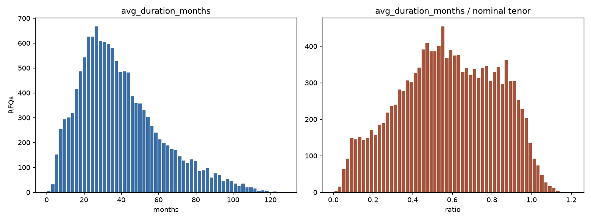
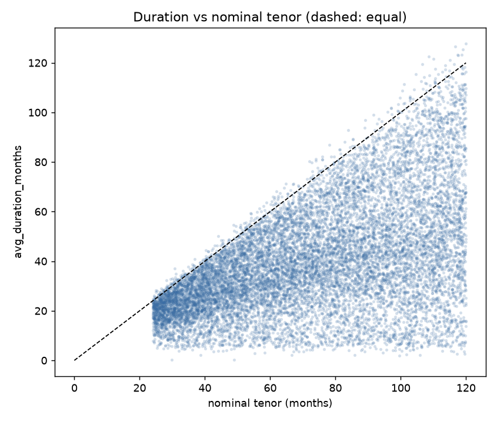
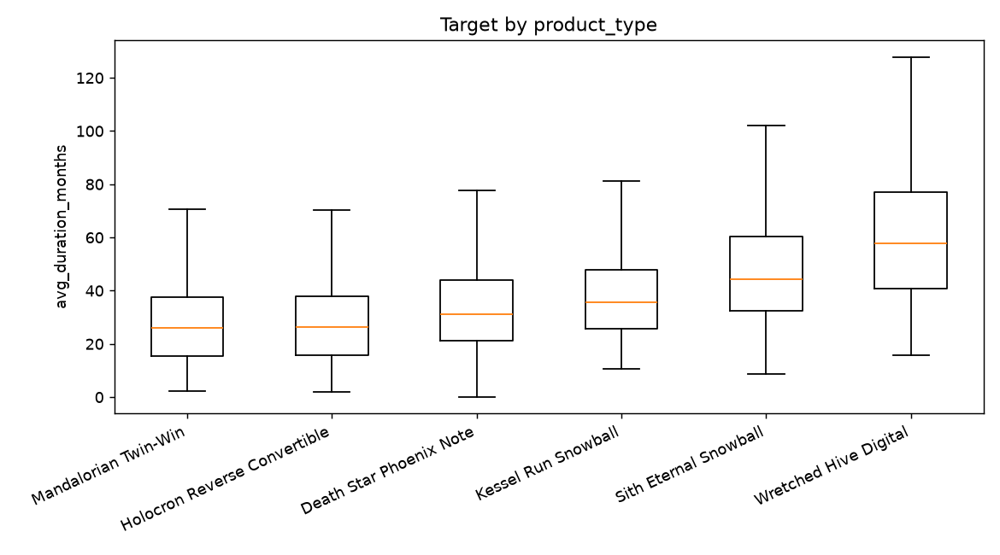
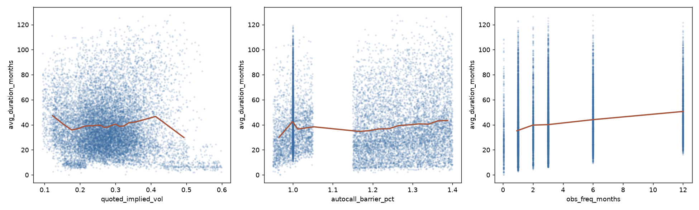
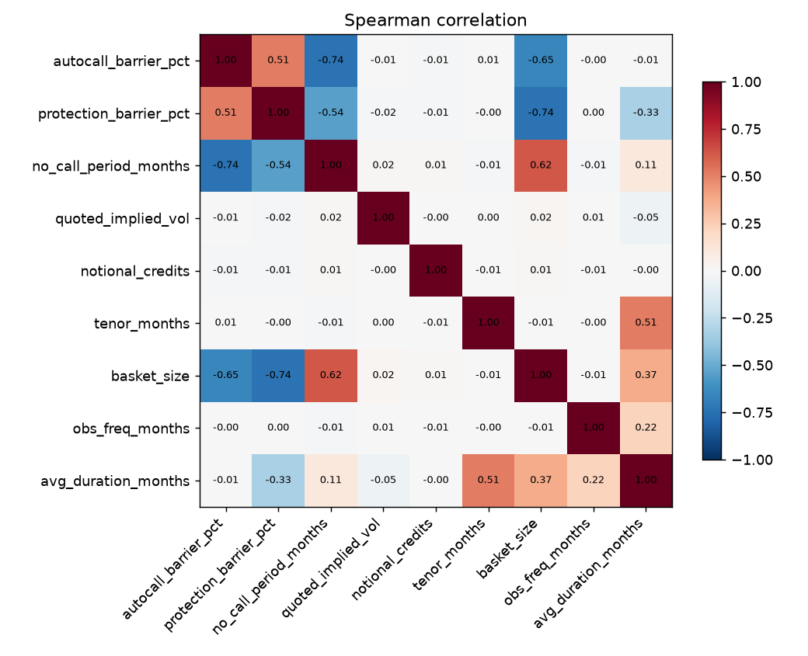
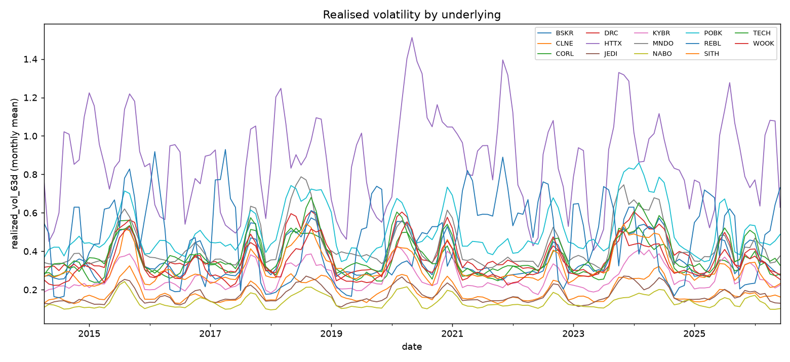
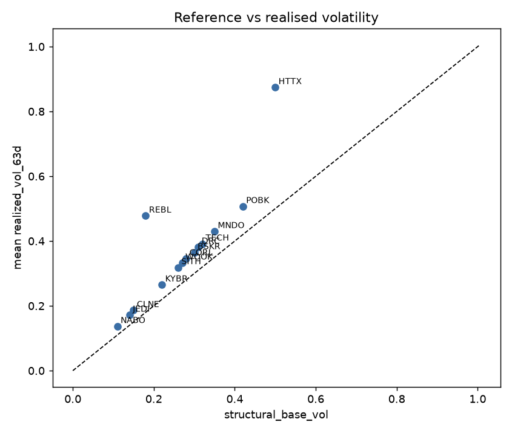

# EDA: raw data profile

Generated by `scripts/run_eda.py`. Companion file: `eda_report.json`.

## Files

| file                      |   rows |   columns |   duplicate rows |
|:--------------------------|-------:|----------:|-----------------:|
| rfqs.csv                  |  25000 |        17 |                0 |
| daily_volatility.csv      |  44744 |         3 |                0 |
| underlyings_reference.csv |     14 |         3 |                0 |

## rfqs.csv

25,000 quote requests between 2016-01-04 and 2024-06-28. 13,796 were executed and 13,796 carry `avg_duration_months`.

| column                 | dtype          |   nulls |   % null |   distinct |
|:-----------------------|:---------------|--------:|---------:|-----------:|
| rfq_id                 | str            |       0 |    0.000 |      25000 |
| product_type           | str            |       0 |    0.000 |          6 |
| underlyings            | str            |       0 |    0.000 |       2043 |
| basket_type            | str            |       0 |    0.000 |          2 |
| autocall_barrier_pct   | float64        |       0 |    0.000 |       3468 |
| protection_barrier_pct | float64        |       0 |    0.000 |       3409 |
| no_call_period_months  | int64          |       0 |    0.000 |          7 |
| observation_frequency  | str            |       0 |    0.000 |         18 |
| quoted_implied_vol     | float64        |       0 |    0.000 |       4146 |
| notional_credits       | int64          |       0 |    0.000 |          7 |
| counterparty           | str            |       0 |    0.000 |          8 |
| trader_id              | str            |       0 |    0.000 |         39 |
| requested_date         | datetime64[us] |       0 |    0.000 |       2215 |
| executed               | bool           |       0 |    0.000 |          2 |
| start_date             | datetime64[us] |       0 |    0.000 |       3093 |
| end_date               | datetime64[us] |       0 |    0.000 |       5289 |
| avg_duration_months    | float64        |   11204 |   44.820 |       6506 |

### Numeric columns

| column                 |   count |        mean |           std |         min |         25% |         50% |         75% |            max |
|:-----------------------|--------:|------------:|--------------:|------------:|------------:|------------:|------------:|---------------:|
| autocall_barrier_pct   |   25000 |       1.139 |         0.147 |       0.950 |       1.000 |       1.153 |       1.276 |          1.400 |
| protection_barrier_pct |   25000 |       0.664 |         0.096 |       0.500 |       0.600 |       0.622 |       0.761 |          0.850 |
| no_call_period_months  |   25000 |       1.480 |         2.017 |       0.000 |       0.000 |       0.000 |       3.000 |          6.000 |
| quoted_implied_vol     |   25000 |       0.279 |         0.089 |       0.094 |       0.218 |       0.274 |       0.330 |          0.600 |
| notional_credits       |   25000 | 676,412.000 | 1,695,564.509 | 100,000.000 | 100,000.000 | 250,000.000 | 500,000.000 | 20,000,000.000 |
| tenor_months           |   25000 |      71.914 |        27.653 |      24.014 |      47.988 |      71.748 |      95.828 |        119.974 |
| basket_size            |   25000 |       1.828 |         0.689 |       1.000 |       1.000 |       2.000 |       2.000 |          3.000 |

`tenor_months` (`end_date - start_date`) and `basket_size` are derived here.

### Categorical columns

**product_type** (6 values shown):

| value                        |   count |   share |
|:-----------------------------|--------:|--------:|
| Holocron Reverse Convertible |    4245 |  16.980 |
| Mandalorian Twin-Win         |    4216 |  16.860 |
| Wretched Hive Digital        |    4167 |  16.670 |
| Sith Eternal Snowball        |    4160 |  16.640 |
| Death Star Phoenix Note      |    4148 |  16.590 |
| Kessel Run Snowball          |    4064 |  16.260 |

**basket_type** (2 values shown):

| value    |   count |   share |
|:---------|--------:|--------:|
| worst_of |   16539 |  66.160 |
| single   |    8461 |  33.840 |

**observation_frequency** (18 values shown):

| value      |   count |   share |
|:-----------|--------:|--------:|
| 1M         |    6174 |  24.700 |
| 3M         |    5298 |  21.190 |
| 6M         |    3618 |  14.470 |
| 2M         |    1995 |   7.980 |
| 1Y         |    1601 |   6.400 |
| 1D         |     711 |   2.840 |
| Monthly    |     670 |   2.680 |
| mensual    |     667 |   2.670 |
| 1 month    |     658 |   2.630 |
| M          |     651 |   2.600 |
| Quarterly  |     576 |   2.300 |
| trimestral |     570 |   2.280 |
| Q          |     566 |   2.260 |
| 3 months   |     559 |   2.240 |
| 12M        |     191 |   0.760 |
| Y          |     175 |   0.700 |
| Annual     |     164 |   0.660 |
| anual      |     156 |   0.620 |

**counterparty** (8 values shown):

| value                    |   count |   share |
|:-------------------------|--------:|--------:|
| Corellian Capital        |    3195 |  12.780 |
| Kamino Cloning Trust     |    3160 |  12.640 |
| Banco de Coruscant       |    3157 |  12.630 |
| Chandrila Sovereign Fund |    3125 |  12.500 |
| Alderaan Wealth Partners |    3111 |  12.440 |
| First Order Financial    |    3099 |  12.400 |
| Jabba Asset Management   |    3086 |  12.340 |
| Nal Hutta Traders        |    3067 |  12.270 |

**trader_id** (20 values shown):

| value   |   count |   share |
|:--------|--------:|--------:|
| TRD-018 |     681 |   2.720 |
| TRD-010 |     676 |   2.700 |
| TRD-016 |     672 |   2.690 |
| TRD-022 |     669 |   2.680 |
| TRD-036 |     667 |   2.670 |
| TRD-039 |     664 |   2.660 |
| TRD-005 |     662 |   2.650 |
| TRD-037 |     661 |   2.640 |
| TRD-014 |     659 |   2.640 |
| TRD-009 |     657 |   2.630 |
| TRD-032 |     656 |   2.620 |
| TRD-028 |     656 |   2.620 |
| TRD-024 |     656 |   2.620 |
| TRD-023 |     653 |   2.610 |
| TRD-020 |     651 |   2.600 |
| TRD-026 |     649 |   2.600 |
| TRD-015 |     646 |   2.580 |
| TRD-001 |     644 |   2.580 |
| TRD-003 |     643 |   2.570 |
| TRD-017 |     637 |   2.550 |

Normalised observation frequency:

|   months between observations |   RFQs |
|------------------------------:|-------:|
|                         0.048 |    711 |
|                         1.000 |   8820 |
|                         2.000 |   1995 |
|                         3.000 |   7569 |
|                         6.000 |   3618 |
|                        12.000 |   2287 |

## Target: avg_duration_months

| column              |   count |   mean |    std |   min |    25% |    50% |    75% |     max |
|:--------------------|--------:|-------:|-------:|------:|-------:|-------:|-------:|--------:|
| avg_duration_months |   13796 | 39.783 | 22.105 | 0.160 | 23.568 | 35.380 | 51.952 | 127.710 |
| duration_ratio      |   13796 |  0.579 |  0.245 | 0.003 |  0.400 |  0.579 |  0.778 |   1.203 |

371 products ended within half a month of their nominal tenor; 303 report a duration above it.

### Correlation with the target

| feature                |   spearman vs target |
|:-----------------------|---------------------:|
| tenor_months           |                0.511 |
| basket_size            |                0.370 |
| protection_barrier_pct |               -0.326 |
| obs_freq_months        |                0.223 |
| no_call_period_months  |                0.109 |
| quoted_implied_vol     |               -0.048 |
| autocall_barrier_pct   |               -0.007 |
| notional_credits       |               -0.001 |

### Variance explained by each categorical

Eta squared is the share of the target's variance that falls between the levels of a column rather than within them. `shuffled` is the same statistic after randomising the labels, averaged over 20 draws: it is what the column would score on noise alone, and it grows with the number of levels.

| column                |   levels |   eta squared |   shuffled |
|:----------------------|---------:|--------------:|-----------:|
| product_type          |        6 |        0.2544 |     0.0004 |
| basket_size           |        3 |        0.1320 |     0.0001 |
| basket_type           |        2 |        0.1290 |     0.0001 |
| observation_frequency |       18 |        0.0454 |     0.0014 |
| obs_freq_months       |        6 |        0.0447 |     0.0004 |
| no_call_period_months |        7 |        0.0091 |     0.0005 |
| trader_id             |       39 |        0.0043 |     0.0028 |
| counterparty          |        8 |        0.0004 |     0.0004 |

Target by `product_type`:

| product_type                 |   count |   mean |   median |    std |
|:-----------------------------|--------:|-------:|---------:|-------:|
| Death Star Phoenix Note      |    2283 | 34.690 |   31.130 | 18.050 |
| Holocron Reverse Convertible |    2367 | 28.760 |   26.320 | 16.620 |
| Kessel Run Snowball          |    2219 | 38.960 |   35.510 | 18.030 |
| Mandalorian Twin-Win         |    2299 | 28.590 |   26.000 | 16.990 |
| Sith Eternal Snowball        |    2304 | 48.010 |   44.440 | 20.630 |
| Wretched Hive Digital        |    2324 | 59.710 |   57.820 | 23.330 |

Target by `obs_freq_months`:

|   obs_freq_months |   count |   mean |   median |    std |
|------------------:|--------:|-------:|---------:|-------:|
|             0.048 |     392 | 32.090 |   27.560 | 21.760 |
|             1.000 |    4903 | 35.490 |   30.760 | 21.640 |
|             2.000 |    1085 | 39.790 |   35.110 | 22.740 |
|             3.000 |    4126 | 40.160 |   36.050 | 21.450 |
|             6.000 |    2034 | 44.130 |   39.840 | 21.230 |
|            12.000 |    1256 | 50.670 |   46.740 | 21.580 |

Target by `basket_type`:

| basket_type   |   count |   mean |   median |    std |
|:--------------|--------:|-------:|---------:|-------:|
| single        |    4666 | 28.680 |   26.230 | 16.800 |
| worst_of      |    9130 | 45.460 |   41.240 | 22.340 |

Target by `basket_size`:

|   basket_size |   count |   mean |   median |    std |
|--------------:|--------:|-------:|---------:|-------:|
|             1 |    4666 | 28.680 |   26.230 | 16.800 |
|             2 |    6826 | 44.600 |   39.750 | 22.820 |
|             3 |    2304 | 48.010 |   44.440 | 20.630 |

Target by `no_call_period_months`:

|   no_call_period_months |   count |   mean |   median |    std |
|------------------------:|--------:|-------:|---------:|-------:|
|                       0 |    7901 | 38.790 |   33.680 | 23.690 |
|                       1 |     889 | 38.680 |   35.370 | 19.760 |
|                       2 |     911 | 38.210 |   34.520 | 18.460 |
|                       3 |    1427 | 39.620 |   36.180 | 18.560 |
|                       4 |     885 | 41.760 |   37.950 | 19.670 |
|                       5 |     888 | 43.200 |   39.170 | 20.580 |
|                       6 |     895 | 46.180 |   42.690 | 20.560 |

### Column dependencies

Purity is the weighted share of rows in the modal value of the second column, within each level of the first.

| column       | determines   |   purity |   levels |
|:-------------|:-------------|---------:|---------:|
| product_type | basket_type  |    1.000 |        6 |
| product_type | basket_size  |    1.000 |        6 |
| basket_size  | basket_type  |    1.000 |        3 |

## daily_volatility.csv

Panel from 2014-04-01 to 2026-06-30.

| underlying   |   rows | first               | last                |   max_gap |   mean |   median |   std |   min |   max |
|:-------------|-------:|:--------------------|:--------------------|----------:|-------:|---------:|------:|------:|------:|
| BSKR         |   3196 | 2014-04-01 00:00:00 | 2026-06-30 00:00:00 |     3.000 |  0.365 |    0.328 | 0.095 | 0.208 | 0.592 |
| CLNE         |   3196 | 2014-04-01 00:00:00 | 2026-06-30 00:00:00 |     3.000 |  0.186 |    0.166 | 0.050 | 0.114 | 0.339 |
| CORL         |   3196 | 2014-04-01 00:00:00 | 2026-06-30 00:00:00 |     3.000 |  0.346 |    0.314 | 0.086 | 0.222 | 0.595 |
| DRC          |   3196 | 2014-04-01 00:00:00 | 2026-06-30 00:00:00 |     3.000 |  0.382 |    0.343 | 0.099 | 0.230 | 0.638 |
| HTTX         |   3196 | 2014-04-01 00:00:00 | 2026-06-30 00:00:00 |     3.000 |  0.874 |    0.886 | 0.258 | 0.395 | 1.624 |
| JEDI         |   3196 | 2014-04-01 00:00:00 | 2026-06-30 00:00:00 |     3.000 |  0.172 |    0.156 | 0.043 | 0.096 | 0.284 |
| KYBR         |   3196 | 2014-04-01 00:00:00 | 2026-06-30 00:00:00 |     3.000 |  0.265 |    0.236 | 0.067 | 0.162 | 0.449 |
| MNDO         |   3196 | 2014-04-01 00:00:00 | 2026-06-30 00:00:00 |     3.000 |  0.430 |    0.382 | 0.116 | 0.292 | 0.823 |
| NABO         |   3196 | 2014-04-01 00:00:00 | 2026-06-30 00:00:00 |     3.000 |  0.137 |    0.123 | 0.034 | 0.090 | 0.253 |
| POBK         |   3196 | 2014-04-01 00:00:00 | 2026-06-30 00:00:00 |     3.000 |  0.507 |    0.453 | 0.128 | 0.319 | 0.883 |
| REBL         |   3196 | 2014-04-01 00:00:00 | 2026-06-30 00:00:00 |     3.000 |  0.478 |    0.513 | 0.211 | 0.144 | 0.991 |
| SITH         |   3196 | 2014-04-01 00:00:00 | 2026-06-30 00:00:00 |     3.000 |  0.319 |    0.280 | 0.084 | 0.202 | 0.572 |
| TECH         |   3196 | 2014-04-01 00:00:00 | 2026-06-30 00:00:00 |     3.000 |  0.391 |    0.348 | 0.099 | 0.258 | 0.699 |
| WOOK         |   3196 | 2014-04-01 00:00:00 | 2026-06-30 00:00:00 |     3.000 |  0.333 |    0.300 | 0.085 | 0.205 | 0.570 |

### Stationarity

Augmented Dickey-Fuller test on `realized_vol_63d`, per underlying (lag order chosen by AIC). The null hypothesis is a unit root; a p-value under 0.05 rejects it in favour of stationarity.

| underlying   |   n_obs |   lags |   ADF statistic |   p-value | stationary at 5%   |
|:-------------|--------:|-------:|----------------:|----------:|:-------------------|
| BSKR         |    3169 |     26 |         -6.0030 |    0.0000 | True               |
| CLNE         |    3177 |     18 |         -5.0850 |    0.0000 | True               |
| CORL         |    3170 |     25 |         -4.8560 |    0.0000 | True               |
| DRC          |    3178 |     17 |         -4.6650 |    0.0001 | True               |
| HTTX         |    3195 |      0 |         -5.2860 |    0.0000 | True               |
| JEDI         |    3168 |     27 |         -5.5180 |    0.0000 | True               |
| KYBR         |    3170 |     25 |         -5.4030 |    0.0000 | True               |
| MNDO         |    3171 |     24 |         -5.4400 |    0.0000 | True               |
| NABO         |    3171 |     24 |         -5.8340 |    0.0000 | True               |
| POBK         |    3175 |     20 |         -5.1240 |    0.0000 | True               |
| REBL         |    3193 |      2 |         -5.4000 |    0.0000 | True               |
| SITH         |    3167 |     28 |         -4.8690 |    0.0000 | True               |
| TECH         |    3167 |     28 |         -5.3330 |    0.0000 | True               |
| WOOK         |    3176 |     19 |         -5.1620 |    0.0000 | True               |

### Periodicity

Dominant period per underlying, taken as the strongest non-zero-frequency component of an FFT of `realized_vol_63d` (demeaned, one sample per trading day). Meaningful as a cycle only given the stationarity result above: an FFT peak on a non-stationary (trending) series would not indicate periodicity.

| underlying   |   n_obs |   dominant period (trading days) |   dominant period (years) |
|:-------------|--------:|---------------------------------:|--------------------------:|
| HTTX         |    3196 |                              160 |                      0.63 |
| BSKR         |    3196 |                              457 |                      1.81 |
| CORL         |    3196 |                              457 |                      1.81 |
| CLNE         |    3196 |                              457 |                      1.81 |
| DRC          |    3196 |                              457 |                      1.81 |
| JEDI         |    3196 |                              457 |                      1.81 |
| KYBR         |    3196 |                              457 |                      1.81 |
| NABO         |    3196 |                              457 |                      1.81 |
| WOOK         |    3196 |                              457 |                      1.81 |
| POBK         |    3196 |                              457 |                      1.81 |
| TECH         |    3196 |                              457 |                      1.81 |
| MNDO         |    3196 |                             1598 |                      6.34 |
| SITH         |    3196 |                             1598 |                      6.34 |
| REBL         |    3196 |                             1598 |                      6.34 |

Mean `realized_vol_63d` by calendar month, pooled across all underlyings:

|   month |   mean realized_vol_63d |
|--------:|------------------------:|
|       1 |                   0.366 |
|       2 |                   0.358 |
|       3 |                   0.356 |
|       4 |                   0.351 |
|       5 |                   0.352 |
|       6 |                   0.358 |
|       7 |                   0.372 |
|       8 |                   0.389 |
|       9 |                   0.397 |
|      10 |                   0.397 |
|      11 |                   0.388 |
|      12 |                   0.364 |

Note: `realized_vol_63d` is a trailing 63-trading-day rolling statistic, so autocorrelation at short lags (under ~63 days) is expected from the window overlap alone and is not evidence of periodicity by itself.

## underlyings_reference.csv

| underlying   | sector                             |   structural_base_vol |   mean_realised |
|:-------------|:-----------------------------------|----------------------:|----------------:|
| KYBR         | Mineria de materiales estrategicos |                 0.220 |           0.265 |
| CORL         | Logistica y transporte             |                 0.280 |           0.346 |
| MNDO         | Defensa y armamento                |                 0.350 |           0.430 |
| HTTX         | Comercio y materias primas         |                 0.500 |           0.874 |
| TECH         | Tecnologia y automatizacion        |                 0.320 |           0.391 |
| SITH         | Energia e infraestructuras         |                 0.260 |           0.319 |
| JEDI         | Gestion patrimonial                |                 0.140 |           0.172 |
| BSKR         | Metales y aleaciones               |                 0.300 |           0.365 |
| POBK         | Ocio y entretenimiento             |                 0.420 |           0.507 |
| NABO         | Agricultura y biotecnologia        |                 0.110 |           0.137 |
| REBL         | Renta fija especulativa            |                 0.180 |           0.478 |
| WOOK         | Manufactura                        |                 0.270 |           0.333 |
| CLNE         | Servicios y personal               |                 0.150 |           0.186 |
| DRC          | Consumo y distribucion             |                 0.310 |           0.382 |

Correlation between `structural_base_vol` and the mean realised volatility: 0.866.

## Volatility measures

Four volatility figures exist: `quoted_implied_vol` (rfqs.csv, one per RFQ), `realized_vol_63d` (daily_volatility.csv, joined as-of `requested_date` and averaged across the basket's legs as `rv_mean`), `structural_base_vol` (underlyings_reference.csv, static per ticker, averaged the same way as `sb_mean`), and `mkt_vol` (the cross-sectional mean of `realized_vol_63d` across all underlyings on a given day, joined as-of `requested_date`). Unlike `rv_mean`, `mkt_vol` does not depend on which tickers are in the basket.

| feature            |   quoted_implied_vol |   rv_mean |   sb_mean |   mkt_vol |
|:-------------------|---------------------:|----------:|----------:|----------:|
| quoted_implied_vol |                1.000 |     0.647 |     0.947 |     0.007 |
| rv_mean            |                0.647 |     1.000 |     0.679 |     0.447 |
| sb_mean            |                0.947 |     0.679 |     1.000 |     0.005 |
| mkt_vol            |                0.007 |     0.447 |     0.005 |     1.000 |

| predicting quoted_implied_vol from   |   R^2 |
|:-------------------------------------|------:|
| structural_base_vol only             | 0.896 |
| realized_vol_63d only                | 0.418 |
| market-wide level only               | 0.000 |
| structural + realized                | 0.896 |
| structural + realized + market-wide  | 0.896 |

Spearman correlation with the target (executed RFQs only):

| feature   |   spearman vs target |
|:----------|---------------------:|
| rv_mean   |               -0.127 |
| sb_mean   |               -0.048 |
| mkt_vol   |               -0.038 |

The same, for `mkt_vol`, computed separately within each `product_type`:

| product_type                 |    n |   spearman vs target |
|:-----------------------------|-----:|---------------------:|
| Holocron Reverse Convertible | 2367 |               -0.235 |
| Mandalorian Twin-Win         | 2299 |               -0.233 |
| Wretched Hive Digital        | 2324 |               -0.047 |
| Sith Eternal Snowball        | 2304 |                0.051 |
| Kessel Run Snowball          | 2219 |                0.058 |
| Death Star Phoenix Note      | 2283 |                0.127 |

## Joining the tables

45,699 (RFQ, underlying) pairs; 45,699 have volatility history on or before `requested_date`.

## Data quality checks

| table                 | check                                      | result   |
|:----------------------|:-------------------------------------------|:---------|
| rfqs                  | duplicated rfq_id                          | 0        |
| rfqs                  | executed, no avg_duration_months           | 0        |
| rfqs                  | not executed, has avg_duration_months      | 0        |
| rfqs                  | not executed, has start/end dates          | 11204    |
| rfqs                  | negative avg_duration_months               | 0        |
| rfqs                  | avg_duration_months above nominal tenor    | 303      |
| rfqs                  | avg_duration_months below no-call period   | 0        |
| rfqs                  | end_date before start_date                 | 0        |
| rfqs                  | start_date before requested_date           | 0        |
| rfqs                  | observation_frequency labels               | 18       |
| rfqs                  | of which unmapped                          | 0        |
| rfqs                  | distinct intervals they encode             | 6        |
| rfqs                  | columns with nulls                         | 0        |
| daily_volatility      | duplicated (date, underlying)              | 0        |
| daily_volatility      | null realized_vol_63d                      | 0        |
| daily_volatility      | negative realized_vol_63d                  | 0        |
| daily_volatility      | gaps longer than 7 days                    | 0        |
| underlyings_reference | duplicated underlying                      | 0        |
| underlyings_reference | sectors / tickers                          | 14 / 14  |
| integration           | RFQ tickers missing from reference         | 0        |
| integration           | RFQ tickers missing from vol panel         | 0        |
| integration           | legs with no vol history at requested_date | 0        |

## Figures

Target, in months and as a fraction of the nominal tenor.

Average duration against nominal tenor.

Target distribution per product type.

Target against three contract terms, with binned means.

Spearman correlation between numeric terms and the target.

Monthly mean realised volatility per underlying.

Reference volatility against what the market showed.

